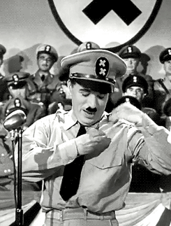

### Introduction {#top}

Today, Wikipedia is part of everybody’s life. It is the first source that most people will check when they want to get information. This website is maintained by volunteers through open collaboration, and what makes its strength, can also bring problems. Wikipedia aims to have a neutral point of view and stay strictly factual but can we guarantee this when anyone can become a contributor? A study [[1]](#ref) observed that a large number of Wikipedia editors change their behavior and focus on editing controversial topics when promoted to administrators, they might be biased (consciously or not) and influence these articles. This concern about bias in Wikipedia content leads us to consider how such biases might extend to user interactions with the platform, such as through the WikiSpeedia game. 

WikiSpeedia is a game where players are tasked with navigating from one Wikipedia article to another using only internal Wikipedia links. The key objective of this game is not just entertainment, but appeared to gather data on how humans perceive the semantic distance between different concepts. The paths that players take from the start article to the end article, along with the number of clicks and the time taken, offer valuable insights into the way people relate and categorize information.[[3]](#ref). We will use this insight to understand the effect of potential political bias. Our study aims to examine the political bias within Wikipedia and its potential impact on Wikispeedia players.

Our dataset is an extensive collection derived from the Wikispeedia game, featuring detailed records of how players moved from one Wikipedia article to another, a process we'll refer to as 'the path' in our subsequent analysis. This dataset encompasses 4,604 Wikipedia articles as they existed in 2009<mark>date a verifier je me rappel plus</mark>, meticulously documenting user navigation and thereby shedding light on patterns in the pursuit of information. It also captures the duration users spend on these paths, providing a window into their engagement levels and the complexity of the topics encountered. Furthermore, the dataset includes categorizations for each article, facilitating focused studies across a variety of knowledge areas. This rich, layered dataset serves as the foundation for our investigation into potential political biases in Wikipedia's content.

### What about Political bias and political figures in wikispeedia ?
Firstly, let’s define political bias : this refers to a tendency to orient or modify information to make a political position more attractive. To define that, plain text of the articles was assessed in relation to two other well-known sites that reproduce wikipedia in a politically biased way: [Rationalwiki](https://rationalwiki.org/wiki/Main_Page) and [Infogalactic](https://infogalactic.com/info/Main_Page). According to [Media Bias/Fact check](https://mediabiasfactcheck.com/), these websites are respectively recognized as having a left-wing
 and right-wing
 bias. After training a machine learning model (BERT with SVM) on data scraped from these websites, Wikispeedia articles are classified according the bias they contain. The results are shown below: 



We can see that most of articles in Wikispeedia are similar to Infogalactic and therefore classified as right wing.

But does this mean that articles in Wikispeedia are biased ? It is too early to say that, we need to go deeper inside our data.<mark> en soi selon notre model, la réponse c'est clairement oui ahaha </mark>
A good way to understand this bias is to look the repartition through each categories of articles to see if there is a notable difference.



Even though most categories have a clear majority of articles with a right bias, in a few categories, such as chemistry or railway transport, they account for less than 50%. 

It seems that article categories can have a link with the political bias in the way they are written. It can be for many reasons but our hypothesis is that it come from the article' authors. Let's think about it. Wikipedia is collaborative website where anyone can write or complete articles. Who takes personal time to write an article on wikipedia ? It has to be people passionated or at least very interested in the subject. In this case, a Ukrainian interested in painting from that time period would be more suceptible to write an article.

This concept becomes particularly pertinent when we turn to politically charged topics like political parties, figures, or events. Here, the contributors are often those who hold strong opinions or affiliations, potentially coloring the articles with their biases.

To put this theory to the test, we specifically zoom in on political figures. They present a straightforward case for categorization based on political affiliations. Our method involved manually classifying political personalities based on their party or ideological leanings, using web sources for accuracy. We then correlated this classification with the perceived bias in their Wikipedia articles. The results of this analysis, revealing the intersection of political affiliation and content bias, are presented below.





<mark>Ptetre ajouter une P value ou autre analyse de correlation</mark>
 There is a trend of right-leaning bias across articles about political figures from various affiliations.
<mark>J'attend le resultat pour finir le Paragraph</mark>

We now have a pretty good overview in the political biases in Wikispeedia articles. We now understand that there is some biases in the way articles are written and there might permeate the content we consume daily. This raises a crucial question: How do these biases translate into interactive online environments, specifically in games like Wikispeedia? In the next section, we delve into the Wikispeedia Analysis to investigate whether the potential biases in Wikipedia articles affect the way players navigate through this game.

### How does the bias affect players during their games ?

In order to answer this quesiton we found interesting to analyse some key metrics about the paths : 
- The percentage of back-clicks
- the mean rating
- the finished percentage 
- the mean time people take.

We correlate these metrics with the political bias of articles on the plot below :

<mark>Via Faut que tu marques 3-4 lignes sur comment ta fait ces analyses depuis les paths, j'ai pas capté comment tu prends les meantime par exemple vu que dans les paths t'as du droite et du gauche en meme temps <mark>



<mark>(about that, pourquoi on normalise aussi les percentage backlicks et finished/unfinished si c’est des % de base, donc de 0 à 1 ?) </mark>
<mark>Les valeurs sur le graphs quand o passe la souris devraient etre les moyennes <mark>

Well, this graph is iteresting. There are significant differences in the way people navigate through wikipedia depending on the bias of the article. 
The graph clearly shows that paths originating from articles with a left-leaning bias tend to be abandoned more frequently, suggesting that players often give up the game when encountering these articles. This might be attributed to difficulties in finding relevant information, leading to confusion. This theory is supported by the observation that the average time spent on left-biased articles is longer compared to those with right or center biases. Additionally, paths featuring a higher proportion of right-leaning articles are associated with more successful game outcomes, indicated by better ratings. However, it's important to consider that right-biased articles also exhibit a higher frequency of back-clicks, implying that users often do not find the information they initially sought.

This analysis is valuable as it offers preliminary insights into how biases in Wikipedia articles might influence user navigation behavior, revealing preferences in information seeking.
We will now delves deeper into the specific choices players make. 

### Analysis of the players

In the Wikispeedia game, the first decision players face is selecting their starting article and determining their destination article. Let's first turn our attention to this aspect of the game. 

Here are the articles the most choosed by the players : 

<mark>ajouter le graph avec les articles les plus choisis au debut et à la fin (finished path) <mark>

Those articles are all very stantard but the something caught our attention in the graph.. Let's look take a look at the first and last article chosen by players but only the political people. Is there a tendency to choose more right people or left people?



Well, that is a little bit akward.

The data reveals a striking trend: Adolf Hitler is chosen as a starting or ending point in the Wikispeedia game far more frequently than any other political figure. It's important to note that this graph uses a logarithmic scale, which underscores the significant disparity in these choices. This raises a question: does this pattern indicate a substantial interest in Adolf Hitler among Wikispeedia players, or could it simply be a coincidental outcome?

#### But is it Statistically significant ?
After performing a t-test on the political figures we can confirm that it is statistically significant as our p-value is close to 0 (1 x 10-62). 

This strongly suggests that the choice of Adolf Hitler as a starting or ending point in the game is not merely a coincidence or a random occurrence. It looks like there is a specific interest or focus on this particular historical figure within the Wikispeedia gaming community. But why Adolf Hitler and not Napoleon or Jules Cesar ? With our team we thought that it can be due to media and the Pop Culture. Hitler and the Nazi regime have been extensively depicted in movies, documentaries, books, and on internet, keeping his memory alive in the public consciousness. Also Hitler is synonymous with extreme ideologies, genocide, and war. Controversial figures often attract more attention, as people seek to understand the motivations and circumstances behind their actions.

For a Wikispeedia player, it can be fun to make the link between a random topic and Adolf Hitler, which represents a challenge in connecting seemingly unrelated extreme subjects.
It's important to note that interest in such a figure does not necessarily equate to support or admiration.

Having gained insights into the initial and final articles chosen by players in Wikispeedia, we now shift our focus to the in-game decisions made during the course of play. Specifically, we aim to explore 
How does the bias of current article impact the next step in the path ?

To answer that we are going to make the following analysis: We'll select a random article from within a player's path and identify its political bias. Then, we will investigate if the next articles chosen by the player tends to align with the same political bias. The key aspect of this analysis is to determine if there's a pattern where players consistently navigate to articles with similar biases, or if the transition from one article to the next reflects a distribution that roughly matches the overall proportions of biases present in our dataset, as represented by the solid line on our graph.



 We can clearly see a difference <mark> ** Do a statistical test ** </mark>.

People tend to pick articles with a right bias or no bias more than expected, and less articles with a left bias, no matter what article they come from. Do people tend to avoid articles with a left-leaning bias ? 
We cannot say for sure ; other parameters can come into play. For example, do articles link to different kind of articles depending on their bias ? 

### Conclusion

Our exploration into the realm of political biases in Wikipedia and their potential influence on Wikispeedia players has led us to some intriguing observations. There seems to be a pattern where players' choices within the game are influenced by the political tone of the articles. This trend is suggested by the tendency of players to choose certain types of articles more frequently, and how their subsequent selections might align with specific political leanings. 

However, it's crucial to remember that these are initial observations and not absolute conclusions. Our determinations of the political affiliations of articles are based on a model we created, which, while useful, does not offer 100% accuracy.

Acknowledging the exploratory nature of our study, it's evident that further research is necessary. A broader dataset would be invaluable in deepening our understanding of the nuances in player behavior and the motivations behind their choices. Future investigations could aim to more accurately determine how these observed biases in navigation might reflect larger patterns in how people interact with information online, particularly in politically sensitive contexts

#### References {#ref}

[1] : Das, S., Lavoie, A., & Magdon-Ismail, M. (2016). Manipulation among the arbiters of collective intelligence: How Wikipedia administrators mold public opinion. ACM Transactions on the Web (TWEB), 10(4), 1-25.

[2] Hube, C. (2017, April). Bias in wikipedia. In Proceedings of the 26th International Conference on World Wide Web Companion (pp. 717-721).

[3] West, R., Pineau, J., & Precup, D. (2009, June). Wikispeedia: An online game for inferring semantic distances between concepts. In Twenty-First International Joint Conference on Artificial Intelligence.

[[top]](#top)